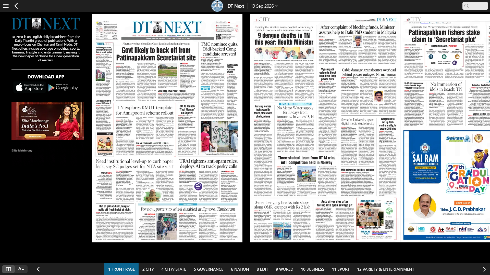
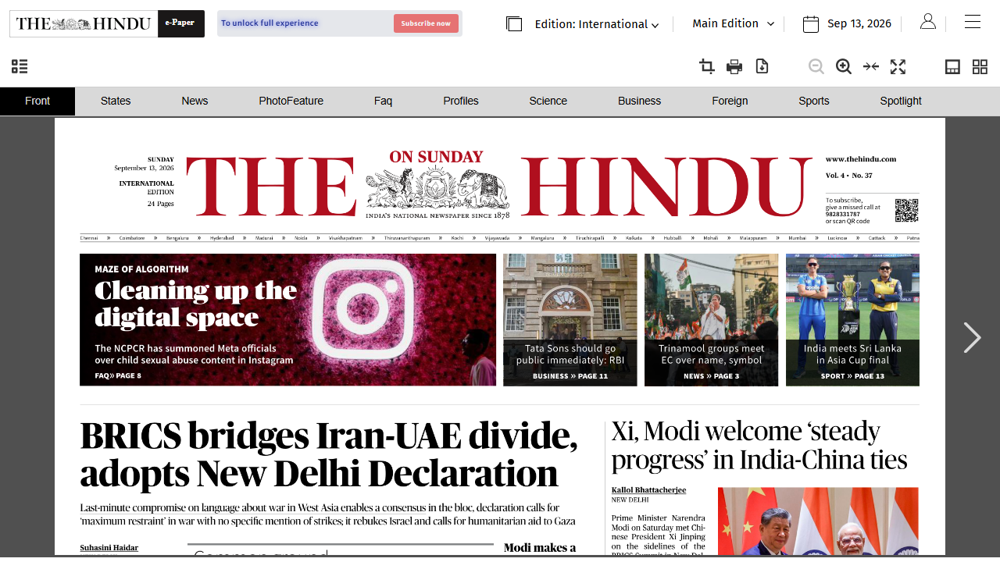

# Automated ePaper Harvester & Regional Media Platform 📰

<div align="center">


**Enterprise-Grade Autonomous Print & Regional Media Intelligence Ecosystem**

*Autonomous scheduled broadsheet harvesting, paywall evasion, multi-tier OCR across 12 Indic languages, 3-Tier Digital Twin traceability, and real-time alert dispatch to WhatsApp, Telegram, and Email.*

[](https://www.python.org/)
[](https://fastapi.tiangolo.com/)
[](https://playwright.dev/)
[](https://github.com/RapidAI/RapidOCR)
[](https://apscheduler.readthedocs.io/)
[](LICENSE)

[Key Features](#key-features) • [Architecture](#system-architecture) • [3-Tier Traceability](#3-tier-digital-twin-traceability) • [Publications](#supported-publications-matrix) • [Quick Start](#quick-start) • [CLI Reference](#cli-reference) • [API Guide](#api-endpoints)

</div>

---

## Executive Overview

The **Automated ePaper Harvester (VEE2)** is an enterprise media-monitoring and broadsheet intelligence platform designed to automate the full lifecycle of print and regional journalism. It solves the critical challenge of monitoring physical and digital newspaper releases at scale across India, monitoring **57+ national and regional publications in 12 languages**.

From automated early-morning headless browser harvesting to anti-bot evasion, paywalled cookie injection, high-DPI image stitching, and ONNX-accelerated OCR, the platform transforms physical broadsheets into searchable, auditable, and instantly distributable intelligence.

---

## Highlights at a Glance

| Metric / Capability | Specification | Details |
| :--- | :--- | :--- |
| **Configured Publications** | **57+ Sources** | National English, Hindi, Telugu, Tamil, Marathi, Bengali, Gujarati, Kannada, Malayalam, Odia, Punjabi, Urdu |
| **Supported Languages** | **12 Languages** | Multi-lingual script detection with Indic ligature support |
| **Harvesting Engines** | **4 Adaptive Engines** | Manifest JSON API, Playwright Stealth Chromium, Direct Stream PDF, Vector Stitcher |
| **Traceability Standard** | **3-Tier Digital Twin** | English Summary ⇄ Ground-Truth OCR ⇄ High-Res Scanned Broadsheet Bounding Box |
| **OCR Infrastructure** | **Triple-Engine OCR** | RapidOCR (ONNX Runtime) + Multilingual Tesseract 5 + PaddleOCR |
| **News Taxonomy** | **19 Standard Categories** | Politics, Sports, Business, Finance, Crime, Environment, Health, Science, Tech, etc. |
| **Alert Integrations** | **Multi-Channel** | WhatsApp Bot (Green API), Telegram Bot (@Mhjkbktbot), Inbound IMAP monitor & Outbound HTML digests |
| **Execution Schedule** | **Automated Cron** | Early-morning staggered harvest window (04:30 AM – 05:45 AM IST) |

---

## Visual Showcase

<div align="center">

### Glassmorphic Dashboard & Real-Time Monitoring
*Real-time log streaming, live WebSocket sync, source filtering, and instant harvest triggers.*


---

### In-Browser Broadsheet Replica Reader & Traceability Audit
*Side-by-side verification: English translation, raw regional OCR text, and highlighted broadsheet bounding box.*


---

### Autonomous Headless Browser Scraping & Bot Evasion
*Automated session injection, dynamic canvas interception, and headless Chromium execution.*

| DT Next Dynamic Broadsheet Harvest | The Hindu Paywall & Canvas Extraction |
| :---: | :---: |
|  |  |

</div>

---

## System Architecture

```mermaid
flowchart TD
    subgraph Sources["1. Newspaper Ingestion Sources"]
        S1["Scheduled Cron (04:30-05:45 AM IST)"]
        S2["Manual Web Dashboard Trigger"]
        S3["IMAP Email Inbox PDF Monitor"]
        S4["Batch Multi-PDF Drag & Drop"]
    end

    subgraph Engines["2. Adaptive Extraction Engines"]
        E1["Manifest API Engine\n(Concurrent JSON/Tile Assembler)"]
        E2["Playwright Stealth Engine\n(Anti-Bot, Cookie Injection, Canvas Rip)"]
        E3["Direct PDF Engine\n(Vector Stream Downloader)"]
        E4["High-DPI Image Stitcher\n(PIL + PyPDF Composition)"]
    end

    subgraph Processing["3. Computer Vision & NLP Pipeline"]
        P1["High-Res Rendering (300 DPI pypdfium2)"]
        P2["Dual-Engine OCR\n(RapidOCR ONNX + Tesseract 5)"]
        P3["Article Segmentation &\nBounding Box Detection"]
        P4["LLM & Translation Service\n(Named Entity Preservation)"]
        P5["19-Category Classification\n(Politics, Business, Sports, etc.)"]
    end

    subgraph Storage["4. Digital Twin Storage & Indexing"]
        D1[("PDF Archive Storage\n14-Day Auto Retention")]
        D2[("Inverted Full-Text Search Index")]
        D3[("Session Manager\nNetscape & JSON Cookies")]
    end

    subgraph Delivery["5. Multi-Channel Distribution"]
        O1["FastAPI Glassmorphic Web Dashboard"]
        O2["Enterprise WhatsApp Bot (Green API)"]
        O3["Telegram Command Bot & Alerts"]
        O4["SMTP Outbound HTML Email Digest"]
        O5["Executive PDF Clipping Export"]
    end

    Sources --> Engines
    Engines --> Processing
    Processing --> Storage
    Storage --> Delivery
```



---

## 3-Tier Digital Twin Traceability

To combat hallucinations and ensure journalistic accountability, the system enforces a strict **3-Tier Audit Hierarchy** on every extracted article:

```
┌─────────────────────────────────────────────────────────────────┐
│ TIER 1: VERIFIED ENGLISH TRANSLATION                           │
│ Concise, readable English summary with preserved Named Entities│
├─────────────────────────────────────────────────────────────────┤
│                             ▲                                   │
│                             │ 1-to-1 Mapping                    │
│                             ▼                                   │
├─────────────────────────────────────────────────────────────────┤
│ TIER 2: OCR GROUND-TRUTH EXTRACTION                             │
│ Raw regional script exactly as extracted by RapidOCR / Tesseract│
│ Includes confidence scoring (e.g., 98.5%) and language tagging  │
├─────────────────────────────────────────────────────────────────┤
│                             ▲                                   │
│                             │ Coordinate Bounding Box           │
│                             ▼                                   │
├─────────────────────────────────────────────────────────────────┤
│ TIER 3: PHYSICAL BROADSHEET SCAN SNAPSHOT                       │
│ High-resolution (300 DPI) crop of the printed newspaper page    │
│ [x1, y1, x2, y2] coordinate highlight ensuring zero tampering  │
└─────────────────────────────────────────────────────────────────┘
```

---

## Supported Publications Matrix

The platform catalogs **57 distinct newspaper outlets** categorized by language and state edition:

| Language | Sources | Prominent Configured Publications |
| :--- | :---: | :--- |
| **English** | 16 | The Times of India, The Hindu, Indian Express, Hindustan Times, Economic Times, Mint, Financial Express, Business Standard, Deccan Herald, Deccan Chronicle, The Tribune, The Telegraph, The Pioneer, The Statesman, Mid-Day, Free Press Journal |
| **Hindi** | 12 | Dainik Bhaskar, Dainik Jagran, Amar Ujala, Navbharat Times, Hindustan Hindi, Punjab Kesari, Prabhat Khabar, Rajasthan Patrika, Lokmat Samachar, Haribhoomi, Jansatta, Rashtriya Sahara |
| **Telugu** | 8 | Eenadu, Sakshi, Andhra Jyothi, Namasthe Telangana, Prajasakti, Nava Telangana, Surya, Vaartha |
| **Tamil** | 5 | Daily Thanthi, Dinamalar, Dinakaran, Hindu Tamil Thisai, Dinamani |
| **Marathi** | 6 | Lokmat, Loksatta, Maharashtra Times, Sakaal, Saamana, Pudhari |
| **Bengali** | 4 | Anandabazar Patrika (ABP), Bartaman, Ei Samay, Sangbad Pratidin |
| **Gujarati** | 3 | Gujarat Samachar, Sandesh, Divya Bhaskar |
| **Kannada** | 4 | Prajavani, Vijayavani, Vijaya Karnataka, Kannada Prabha |
| **Malayalam**| 3 | Malayala Manorama, Mathrubhumi, Deshabhimani |
| **Odia, Punjabi, Urdu** | 3 | Sambad, Daily Ajit, The Inquilab |

---

## Key Capabilities

### 1. Paywall & Session Management
- Seamlessly injects authenticated cookies for paid subscription editions (**The Hindu, Times of India, Lokmat, Loksatta, Financial Express, DT Next**).
- Supports single-file cookie import in both **JSON array** and **Netscape HTTP Cookie File** formats.
- Real-time validity inspection, expiration date detection, and automated cookie deduplication.

### 2. Multi-Channel Alert & Bot Infrastructure
- **WhatsApp Bot**: Enterprise Green API webhook listener allowing users to receive breaking news alerts and query publication status directly from WhatsApp.
- **Telegram Bot**: Full-featured interactive bot with command parsing (`/start`, `/search`, `/latest`, `/sources`) and broadcast channel notifications.
- **Inbound Email Monitor**: Continuously polls IMAP inboxes for incoming daily press releases or PDF attachments, executing automated OCR upon arrival.
- **Outbound Email Digests**: Generates styled HTML digests with categorized summaries and traceability links dispatched via SMTP.

### 3. Inverted Full-Text PDF Search
- Real-time inverted indexing across thousands of processed broadsheet pages.
- Query by keyword, date range, or publication source with instantaneous multi-hit extraction.
- One-click **Executive PDF Clipping Report Generator** combining search hits, article crops, and metadata into a shareable dossier.

### 4. Storage Retention & Auto-Cleanup
- Built-in disk retention policy (default: 14-day window).
- Automatic purge routines for stale PDF archives, temporary tiles, and unlinked image crops.
- Front-page thumbnail caching for rapid UI catalog browsing.

---

## Quick Start

### Prerequisites
- **Python 3.10+** (Python 3.11 or 3.12 recommended)
- **Tesseract OCR 5.x** (with Indic language packs: `hin`, `tam`, `tel`, `mar`, `ben`, `guj`, `kan`, `mal`)
- **Git**

### Installation

```bash
# 1. Clone the repository
git clone https://github.com/Kumaresan-31/Print-and-Regional-media.git
cd Print-and-Regional-media

# 2. Create and activate a virtual environment
python -m venv .venv
# On Windows (PowerShell):
.\.venv\Scripts\Activate.ps1
# On Linux/macOS:
source .venv/bin/activate

# 3. Install dependencies
pip install -r requirements.txt

# 4. Install Playwright browser binaries
playwright install chromium

# 5. Configure environment variables
cp .env.example .env
# Edit .env with your SMTP, Telegram, or WhatsApp credentials (optional)
```

### Launch the Web Application

Start the FastAPI application and background workers:

```bash
cd backend
python -m harvester.cli serve --port 8000
```

Open your browser at:
👉 **[http://localhost:8000](http://localhost:8000)**

---

## CLI Reference

The built-in CLI provides complete control over the harvesting, indexing, and notification workflows:

```bash
# Set PYTHONPATH to include backend
$env:PYTHONPATH="backend"   # Windows PowerShell
export PYTHONPATH="backend"  # Linux / macOS

# List all supported newspapers:
python -m harvester.cli list
python -m harvester.cli list --language Telugu

# Harvest today's Delhi edition of Indian Express:
python -m harvester.cli run --source indian_express --edition delhi

# Harvest a specific historical date:
python -m harvester.cli run --source eenadu --edition hyderabad --date 2026-08-29

# Run batch harvest across all scheduled sources:
python -m harvester.cli run-all

# Inspect downloaded archives:
python -m harvester.cli archive

# Import session cookies for paywalled publications:
python -m harvester.cli import-cookies --source toi --file cookies.json

# Run disk retention cleanup (e.g. purge older than 14 days):
python -m harvester.cli purge --days 14

# Test WhatsApp Green API connection:
python -m harvester.cli test-whatsapp

# Launch interactive Telegram bot listener:
python -m harvester.cli telegram-bot
```

---

## REST & WebSocket API Reference

| Method | Endpoint | Description |
| :--- | :--- | :--- |
| `GET` | `/api/sources` | Lists all 57 configured publications with active edition metadata |
| `POST` | `/api/harvest` | Triggers immediate harvest job for a specific publication and edition |
| `GET` | `/api/jobs` | Returns real-time status and progress of running harvest jobs |
| `GET` | `/api/archives` | Lists downloaded PDF editions with front-page thumbnail links |
| `GET` | `/api/news/{source_id}` | Fetches live categorized news feed with dual-channel fallback |
| `GET` | `/api/traceability/{art_id}` | Retrieves full 3-Tier Traceability record (translation, OCR, coordinates) |
| `GET` | `/api/snapshots/{doc}/{page}` | Serves high-resolution broadsheet page image snapshot |
| `POST` | `/api/newspaper/upload-batch`| Uploads multi-PDF batch for full-page OCR and category segmentation |
| `GET` | `/api/newspaper/search-pdf` | Inverted index search across harvested broadsheets |
| `POST` | `/api/newspaper/export-pdf` | Compiles filtered articles into an executive PDF clipping report |
| `WS` | `/ws/logs` | Real-time WebSocket streaming of server logs and worker events |

---

## Repository Structure

```
Print-and-Regional-media/
├── backend/                        # Application backend core
│   ├── harvester/                  # Main Python package
│   │   ├── api/                    # FastAPI endpoints, routes & WebSocket handlers
│   │   │   └── app.py
│   │   ├── auth/                   # Session persistence & cookie import engine
│   │   │   └── session_manager.py
│   │   ├── automation/             # Inbound IMAP email inbox monitor
│   │   │   └── email_monitor.py
│   │   ├── captcha/                # Anti-bot stealth & OCR captcha solver
│   │   │   └── solver.py
│   │   ├── extractors/             # Scraper engines & source implementations
│   │   │   ├── engines/            # Browser, Manifest, Stitcher, Marathi OCR
│   │   │   └── sources/            # 57 publication scrapers (TOI, Hindu, etc.)
│   │   ├── news/                   # PDF parsing, segmentation & search indexing
│   │   │   ├── pdf_parser.py       # Dual-engine OCR & article segmenter
│   │   │   ├── pdf_search_index.py # Inverted index full-text search
│   │   │   ├── news_cropper.py     # High-res bounding-box visual cropper
│   │   │   └── alerts_service.py   # 3-Tier traceability alert generator
│   │   ├── notifications/          # Multi-channel notification dispatchers
│   │   │   ├── whatsapp_service.py # Green API integration
│   │   │   ├── telegram_service.py # Telegram bot listener & broadcast
│   │   │   └── email_service.py    # SMTP HTML digest generator
│   │   ├── scheduler/              # APScheduler cron management (IST)
│   │   ├── storage/                # Storage metrics, thumbnails, retention
│   │   ├── translation/            # LLM & Indic translation service
│   │   ├── cli.py                  # Command-line interface
│   │   ├── config.py               # Application configuration
│   │   ├── models.py               # Pydantic data schemas
│   │   ├── orchestrator.py         # Worker pool & async event broadcaster
│   │   └── registry.py             # 57-newspaper publication catalog
├── frontend/                       # Web dashboard assets
│   ├── templates/                  # Jinja2 / HTML templates
│   │   ├── index.html              # Main glassmorphic harvest & reader dashboard
│   │   ├── upload.html             # Multi-PDF hardcopy broadsheet harvester
│   │   ├── inbox.html              # Inbound email attachment monitor
│   │   └── search.html             # Inverted PDF full-text search
│   └── static/                     # CSS & Vanilla JavaScript
│       ├── css/style.css           # Modern dark-mode design system
│       └── js/app.js               # Reactive frontend with WebSocket sync
├── assets/                         # Showcase screenshots and project branding
├── tests/                          # Comprehensive unit & integration test suite
├── .env.example                    # Environment variable template
├── .gitignore                      # Production-ready git ignore configuration
├── render.yaml                     # Render cloud deployment specification
├── requirements.txt                # Python project dependencies
└── setup.py                        # Package installation setup
```

---

## Testing

The test suite covers registry validation, session persistence, OCR extraction, translation, email ingestion, and API routes:

```powershell
# Set PYTHONPATH and execute unittest suite:
$env:PYTHONPATH="backend"
python -m unittest discover -s tests -p "test_*.py"
```

---

## Deployment

The application is cloud-ready and configured for deployment on **Render**, **AWS ECS**, or any Dockerized container platform.

Refer to [`DEPLOYMENT_RENDER.md`](file:///d:/Projects/EPaper-Harvester-VEE/DEPLOYMENT_RENDER.md) for full instructions on configuring persistent disks (`/var/data`), environment secrets, and automated build pipelines.

---

## Author

<div align="center">

**Kumaresan B**

[](https://github.com/Kumaresan-31)
[](mailto:kumaresanb312007@gmail.com)

⭐ **If you find this project impressive or useful, please consider giving it a star on GitHub!**

</div>

---

## License

This project is licensed under the MIT License — see the [LICENSE](LICENSE) file for details.
